# PJ1 实验报告

## 1、基本信息

- 姓名：贾子安

- 学号：18307130017

- Github Pages 地址：<a href="https://jimmyokok.github.io/Web-2020-PJ1/">https://jimmyokok.github.io/Web-2020-PJ1/</a>

---------------------------

## 2、项目完成情况

### 2.1 首页

<div align=center>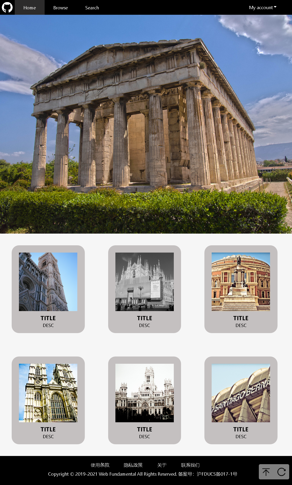</div>

- 重点内容

	<div align=center>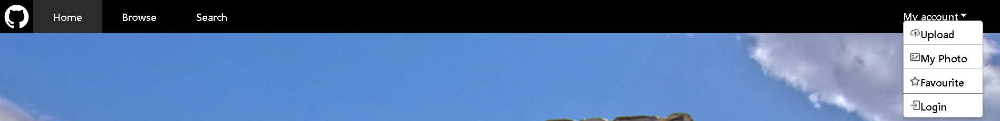</div>

	- 导航栏：鼠标移动到`My account`条目上时显示下拉菜单

	  - 实现方式：

        ```html
        <div class="myaccount">
          <a href="" class="dropdown">
            <p>My account</p>
          </a>
          <div class="dropdown-content">
            <a href="./upload.html">Upload</a>
            <a href="./myphoto.html">My Photo</a>
            <a href="./favor.html">Favourite</a>
            <a href="../index.html">Login</a>
          </div>
        </div>
        ```
    
        一开始先设置为`display:none`,优先级叠最高，防止显示的时候被下面内容遮挡。

        ```css
        .dropdown-content{
          z-index: 999;
          border:solid 1px grey;
          border-radius: 5px;
          background-color: white;
          box-shadow: 0px 2px 4px 0px rgba(0, 0, 0, 0.2);
          position: absolute;
          display: none;
          width: 120px;
        }
        ```
    
        鼠标悬浮在`My account`及其下拉菜单上时用`display:block`覆盖。

        ```css
        .myaccount:hover .dropdown-content {
          display: block;
        }
        .dropdown-content:hover {
          display: block;
        }
        ```
    - 导航栏：鼠标移动到导航栏及下拉菜单各条目时样式变化

      - 实现方式：
      
        ```css
        a:hover{
          color: grey;
        }
        .dropdown-content a:hover{
          color: grey;
        }
        ```
    
    - 辅助图标：

      <div align=center>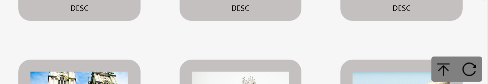</div>

      - 实现方式：
        
        使用`position:fixed`固定其在屏幕中显示的位置。

        ```css
        .auxbuttons{
          background-color: grey;
          border-radius: 5px;
          position: fixed;
          right:10px;
          bottom:20px;
        }
        ```

---------------------------

### 2.2 浏览页

<div align=center>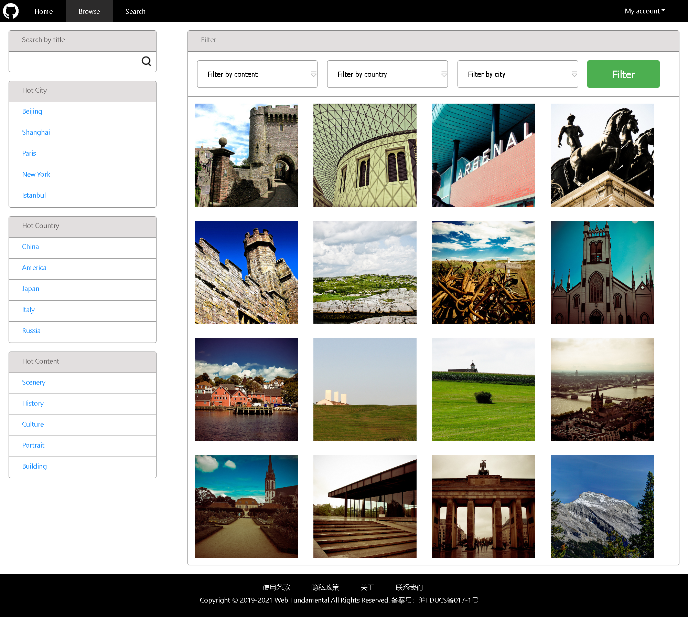</div>

- 重点内容

  - 筛选栏二级联动

    <div align=center>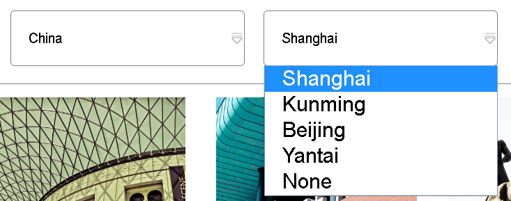</div>

    <div align=center>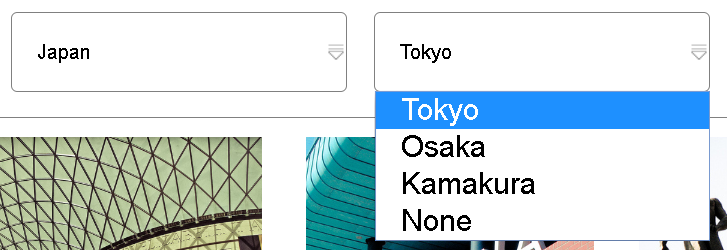</div>
    
    - 实现方式

      - 使用

        ```html
        <option value="..." disabled selected hidden>...</option>
        ```
        实现`select`的类占位符效果。

      > 使用**JQuery**

      - 先设计好选择国家的`select`，把value设置成容易交给程序判断的数字。

        ```html
        <select name="country" class="country">
          <option value="" disabled selected hidden>Filter by country</option>
          <option value="0">China</option>
          <option value="1">Japan</option>
          <option value="2">Italy</option>
          <option value="3">America</option>
          <option value="-1">None</option>
        </select>
        ```

      - 用js操控选择城市的`select`。

        ```js
        $(document).ready(function(){
          $(".country").on("change",function(){
            var op=$(".country").val();
            //China
            if(op=="0"){
              $(".city option").remove();
              $(".city").append("<option value='0'>Shanghai</option>");
              $(".city").append("<option value='1'>Kunming</option>");
              $(".city").append("<option value='2'>Beijing</option>");
              $(".city").append("<option value='3'>Yantai</option>");
              $(".city").append("<option value='-1'>None</option>");
                    }
            //Japan ...
            //America ...
            //Italy ...
            //None ...
          });
        });
        ```
  
  - Filter按钮样式

    <div align=center></div>

    <div align=center></div>
    
    > 鼠标不在按钮上方时为上图，鼠标移动到按钮上方时为下图。本PJ所有的按钮样式都是该按钮的变种。

    - 实现方式
      
      ```html
      <button class="button" onclick="alert('已筛选')"><span>Filter</span></button>
      ```
      
      设置`span`元素动画时间为0.5s，并用`after`伪元素制造一个完全透明的`»`，其位置完全决定于`span`元素。

      ```css
      .button span {
        display: inline-block;
        position: relative;
        transition: 0.5s;
      }
      .button span:after {
        content: '»';
        position: absolute;
        opacity: 0;
        top: -2px;
        right: -20px;
        transition: 0.5s;
      }
      ```

      当鼠标悬浮以后设置`span`元素的`padding-right`，同时让`span:after`变不透明。

      ```css
      .button:hover span {
        padding-right: 15%;
      }
      .button:hover span:after {
        opacity: 1;
        right: 0;
      }
      ```

---------------------------

### 2.3 搜索页、我的照片页、我的收藏页

- 搜索页

<div align=center>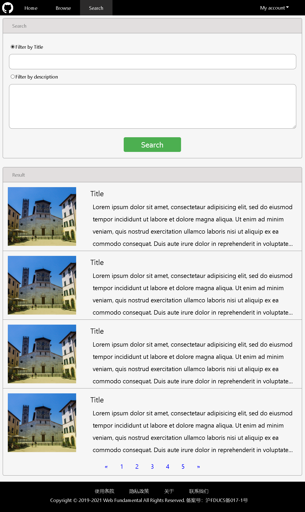</div>

- 我的照片页

<div align=center>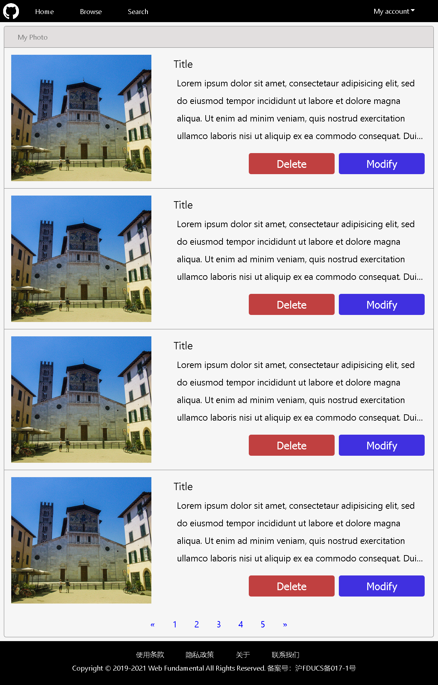</div>

- 我的收藏页

<div align=center>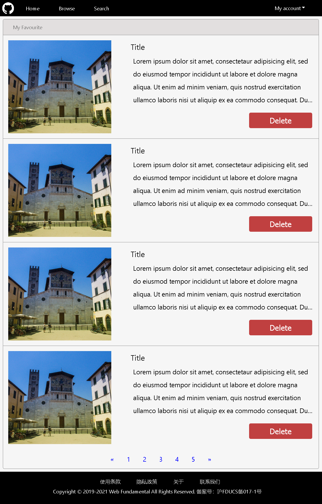</div>

- 重点内容

  - 描述文字中，多行文字溢出显示省略号

    <div align=center>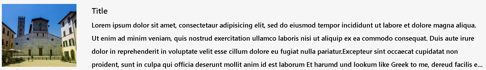</div>

    - 实现方式

      使用自适应布局`-webkit-box`,超出4行自动省略。

      ```css
      .desc{
        display: -webkit-box;
        -webkit-box-orient: vertical;
        -webkit-line-clamp: 4;
        overflow: hidden;
      }
      ```

---------------------------

### 2.4 上传页

<div align=center>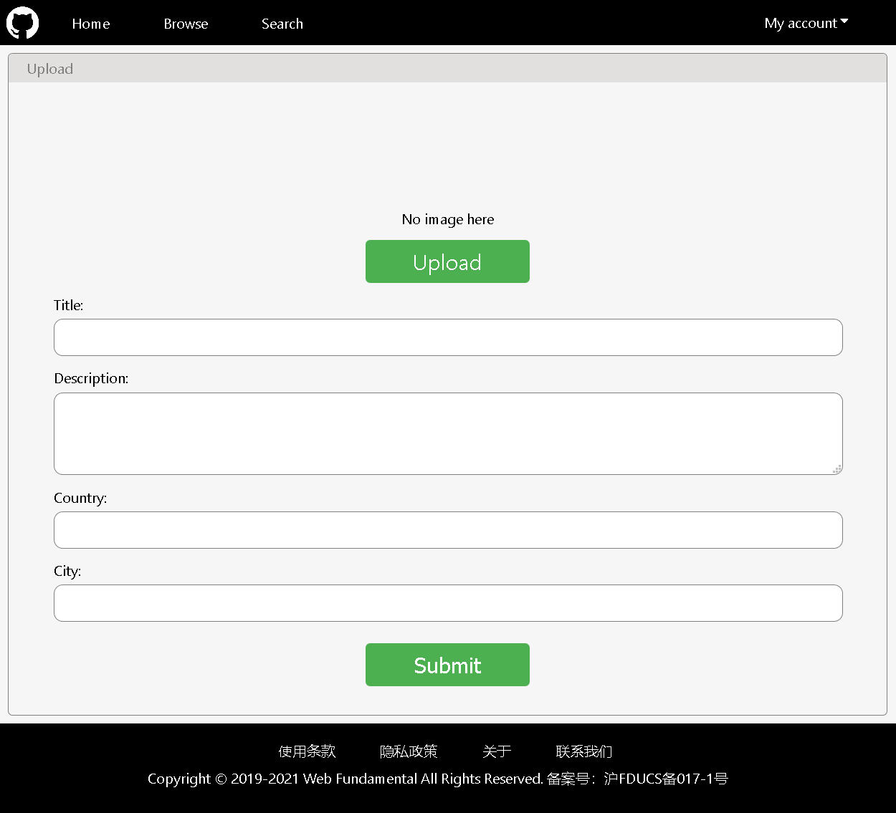</div>

- 重点内容

  - 可以从本地选择图片进行上传

    - 实现方式

      使用`file`类型的`input`

      ```html
      <input class="file" type="file" name="file">
      ```

  - 未上传图片时显示提示文字，上传完成后在页面内显示图片

    - 实现方式

      > 使用**JQuery**

      - 使用`FileReader`的`readAsDataURL`方法，把上传的图片读取为`Data URL`嵌入html文档中，实现图片预览。

      - 将文件名的后缀和`jpeg|png|gif|bmp`比较，判断是否为图片，如果不是则要求重新上传

      - 读取文件的同时修改显示的文件路径，如果没有读取图片则显示`No image here`

      - html代码：

      ```html
      
      <div class="imgpath"><p class="path">No image here</p></div>
      ```

      - js代码：

      ```js
      $(document).ready(function(){
        $(".file").on("change",function(e){
          var fileread = new FileReader();
          var filename = $(this).get(0).files[0];
          var filetype = /jpeg|png|gif|bmp/ig;
          var ext = filename.type.split("/")[1];
          var name=e.currentTarget.files[0].name
          if(filetype.test(ext)){
            $(".button span:nth-child(2)").text("Reupload");
            $(".uploadimg").attr("src","");
            fileread.readAsDataURL(filename);
            fileread.onload=function(){
              $(".path").text(name);
              $(".uploadimg").attr("src",this.result);
            }
          }
          else{
            alert("图片格式不正确，请重新上传！");
          }
        });
      });
      ```

---------------------------

### 2.5 图片详情页

<div align=center>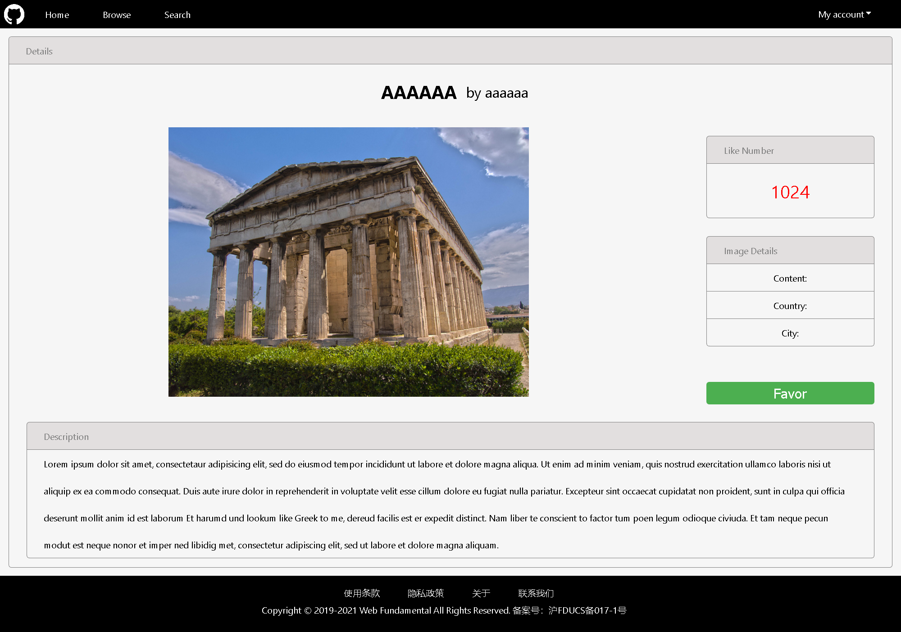</div>

---------------------------

### 2.6 登录页、注册页

- 登录页

<div align=center>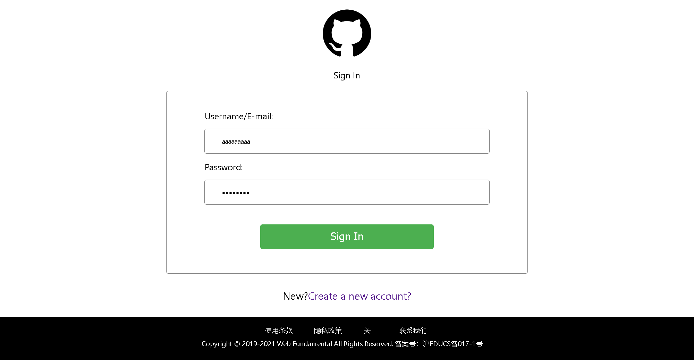</div>

- 注册页

<div align=center>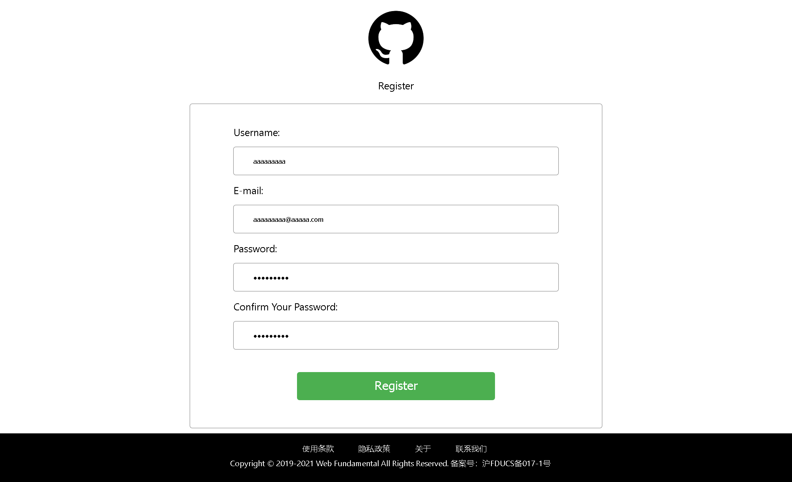</div>

---------------------------

## 3、Bonus完成情况

### 3.1 图片裁剪

- 只使用了`normal`文件夹中的图片

<div align=center>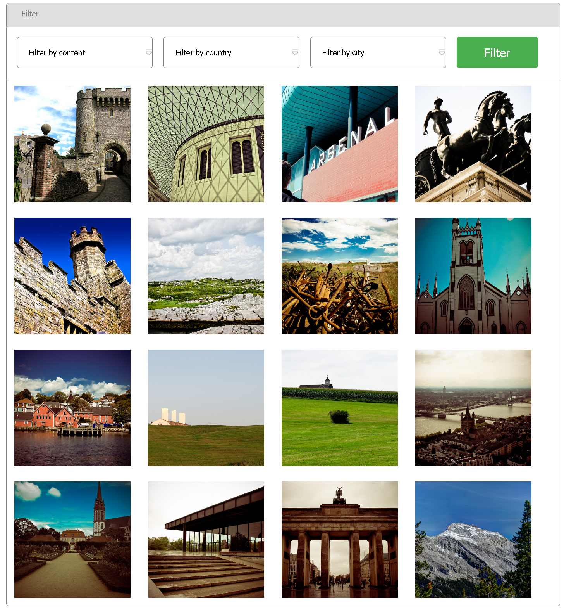</div>

- 实现方式

  - 所有`img`元素都设置`object-fit`属性为`cover`

    ```css
    img{
      object-fit: cover;
    }
    ```
  - 图片将填充整个内容框，多余部分将被自动裁剪。

  - 裁剪时左右(或上下)两边等量裁剪。

---------------------------

### 3.2 响应式布局

- 通过`Meta`标签保持网页`viewport`宽度为设备宽度并且禁止用户缩放，避免出现横向滚动条

  ```html
  <meta name="viewport"content="width=device-width,initial-scale=1.0,maximum-scale=1,user-scalable=no">
  ```

- 通过`Media Query`，根据不同的`viewport`宽度，调用不同的css

  - 例子：**header.css**
  ```css
  @media only screen and ( max-width:600px){
    header{
        height: 30px;
    }
    nav a{
        padding:0 10px;
        height: 30px;
    }
    nav a img{
        height: 30px;
        width: 30px;
    }
    .myaccount{
        height: 30px;
        padding-right:10px;
    }
    .dropdown p{
        padding-top: 5px;
    }
  }
  @media only screen and ( max-width:430px){
    header{
        font-size:12px;
    }
    .dropdown-content{
        right: 20px;
    }
  }
  ```

- 个人对不同的`viewport`宽度进行以下分类：

  - **Desktop**: 1600px+
  - **Large**: 1000px-1600px
  - **Medium**: 600px-1000px+
  - **Medium**: 430px-600px
  - **Tiny**: 300px-430px
  - 宽度小于300px的将无法正常显示

- 截图

  > 仅截取宽度变化时布局变化较大的页面

  > 仅截取宽度为**Medium**、**Medium**和**Tiny**时的页面

  - 首页

  <div align=center>
    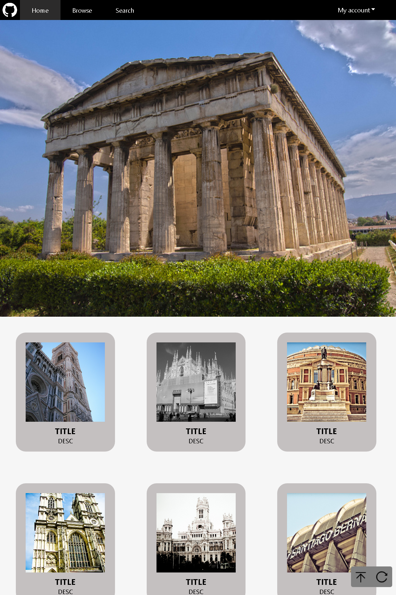
    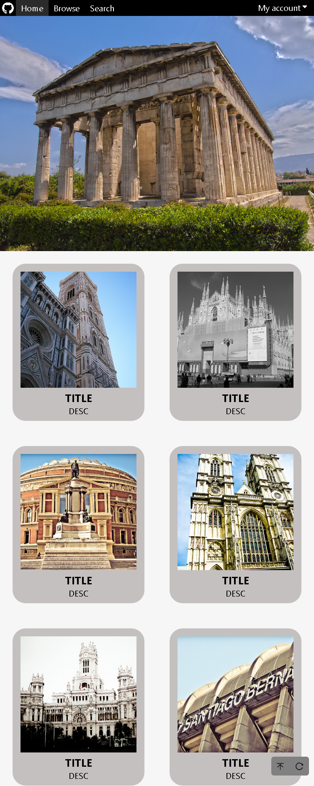
    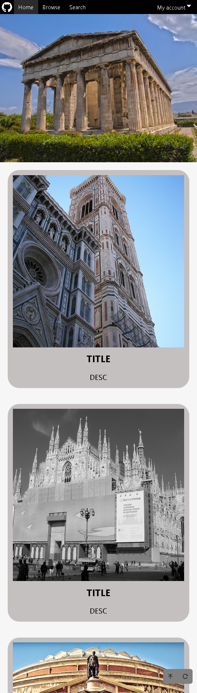
  </div>

  ---------------------------

  - 浏览页

  <div align=center>
    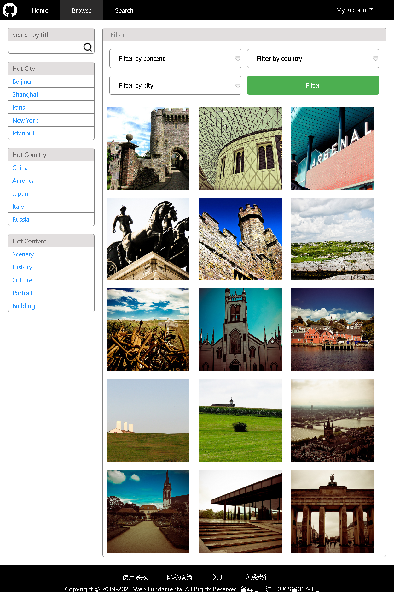
    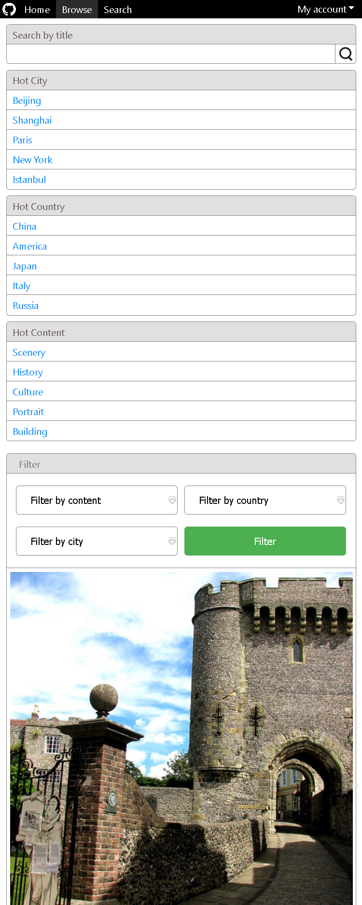
    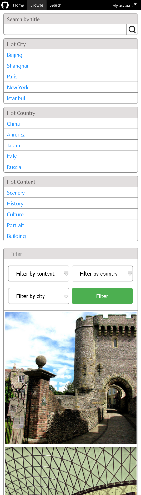
  </div>

  ---------------------------

  - 我的照片页

  <div align=center>
    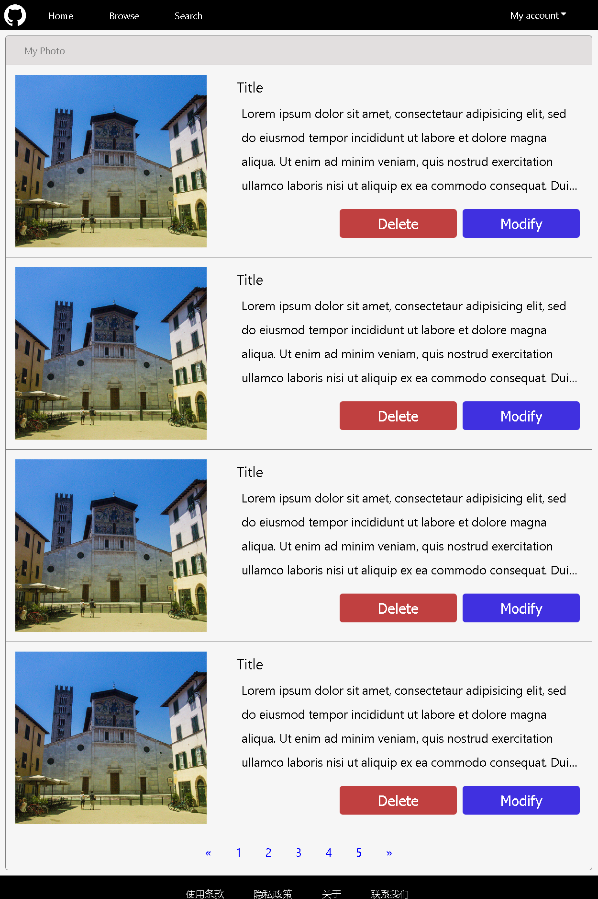
    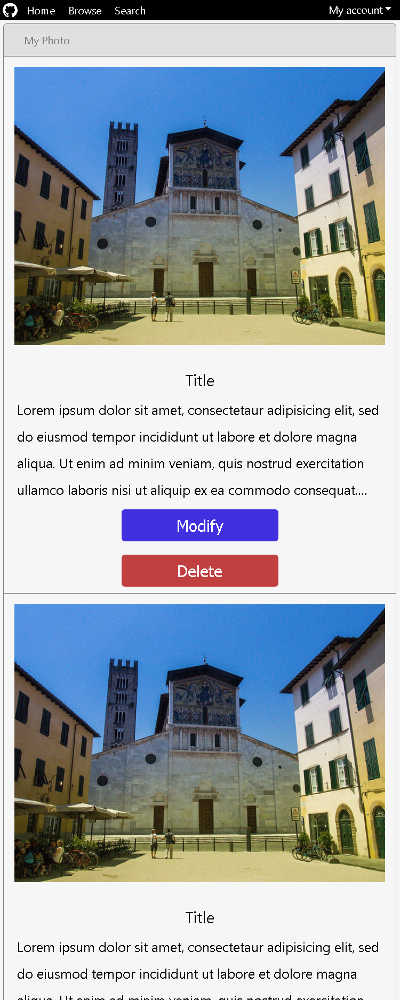
    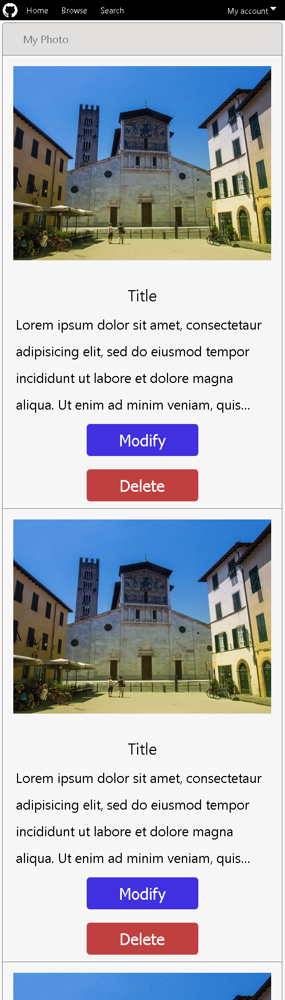
  </div>

  ---------------------------

  - 图片详情页

  <div align=center>
    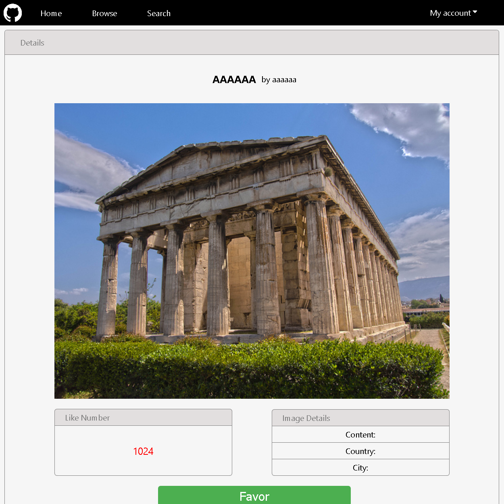
    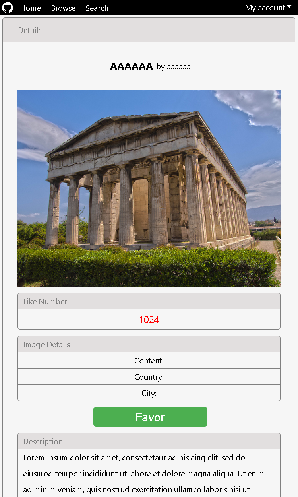
    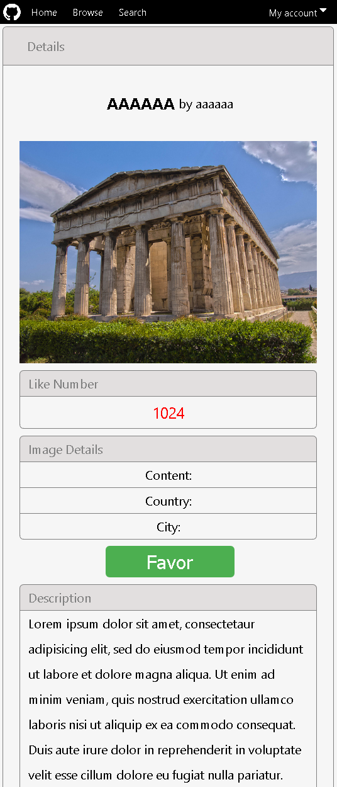
  </div>

---------------------------

## 4. 参考文献

<a href="https://github.com/fudansswebfundamental">fudansswebfundamental</a>

<a href="https://www.w3school.com.cn/">W3school</a>

<a href="https://www.runoob.com/">菜⻦教程</a>

<a href="https://www.iconfont.cn/">阿⾥巴巴⽮量图标库</a>


        

      

